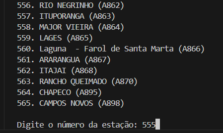

# Analise de Microdados do INMET com Python

## Descrição
  Esta aplicação tem como objetivo facilitar a manipulação e visualização de dados meteorológicos de forma intuitiva e amigável. Além disso, permite ao usuário gerar relatórios completos da estação selecionada, oferecendo uma visão clara e acessível das informações coletadas.

## Instruções de uso

1. **Carregar dados das estações**  
   - Informe a pasta de origem dos registros (`dados_estacoes`) e o ano desejado para importar os dados.
   - Exemplo de input:  
     

2. **Exibir dados das estações**  
   - Visualize todos os dados disponíveis das estações meteorológicas carregadas.
   - Exemplo de input:  
     
   - Exemplo de output:  
     

3. **Exibir estatísticas de uma estação**  
   - Consulte estatísticas como temperatura máxima, mínima, umidade, entre outras, para uma estação específica.
   - Exemplo de input:  
     
   - Exemplo de output:  
     

4. **Filtrar dados por data**  
   - Filtre os dados disponíveis utilizando um intervalo de datas (`DataInicial` e `DataFinal`) para análise personalizada.
   - Exemplo de input:  
     
   - Exemplo de output:  
     

5. **Exportar relatório**  
   - Gere um arquivo de relatório com os primeiros 50 registros de uma estação selecionada.
   - Exemplo de input:  
     
   - Exemplo de output:  
     

---
