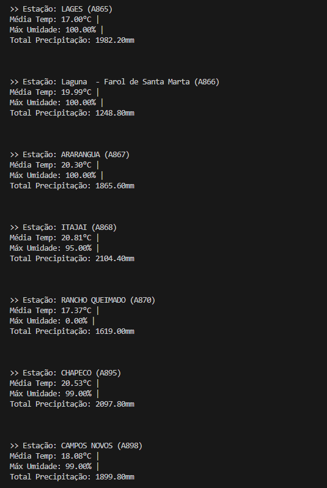

# Análise de Microdados do INMET com Python

Aplicação para manipulação, análise e visualização de dados meteorológicos do INMET, com interface intuitiva e geração de relatórios personalizados.

---

## Sumário

- [Descrição](#descrição)
- [Instalação](#instalação)
- [Como Usar](#como-usar)
- [Exemplos de Uso](#exemplos-de-uso)
- [Dependências](#dependências)

---

## Descrição

Este projeto facilita a manipulação e visualização de microdados meteorológicos, permitindo ao usuário:
- Carregar dados de diferentes estações e anos
- Visualizar dados e estatísticas
- Filtrar por datas
- Gerar relatórios customizados

Ideal para pesquisadores, estudantes e profissionais que desejam explorar dados do INMET de forma prática.

---

## Instalação

1. Clone este repositório:
   ```bash
   git clone https://github.com/marcosmb1234/Analise-de-Microdados-do-INMET-com-Python.git
   cd Analise-de-Microdados-do-INMET-com-Python
   ```

---

## Como Usar

Execute o arquivo principal:
```bash
python main.py
```

Siga as instruções do menu interativo para carregar dados, visualizar informações, filtrar por datas e exportar relatórios.

---

## Exemplos de Uso

### 1. Carregar dados das estações
Informe a pasta de origem dos registros (`dados_estacoes`) e o ano desejado para importar os dados.
Exemplo de input:


### 2. Exibir dados das estações
Visualize todos os dados disponíveis das estações meteorológicas carregadas.
Exemplo de input:

Exemplo de output:


### 3. Exibir estatísticas de uma estação
Consulte estatísticas como temperatura máxima, mínima, umidade, entre outras, para uma estação específica.
Exemplo de output:


### 4. Filtrar dados por data
Filtre os dados disponíveis utilizando um intervalo de datas (`DataInicial` e `DataFinal`) para análise personalizada.
Exemplo de input:

Exemplo de output:


### 5. Exportar relatório
Gere um arquivo de relatório com os primeiros 50 registros de uma estação selecionada.
Exemplo de input:

Exemplo de output:


---

## Dependências

- Python 3.8+

---
